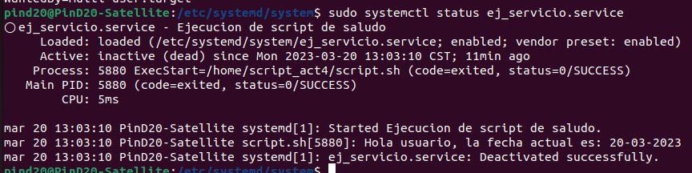

# CREACIÓN DE UN SYSTEMD UNIT DE TIPO SERVICIO

Esta actividad consiste en crear un systemd unit de tipo servicio para ejecutar un script que imprima un saludo y la fecha actual.

El proceso de instalación de este servicio es el siguiente:
<br/><br/>
## Creación del Script

Primero debemos crear el script que deseamos utilizar en el servicio, para este caso fue creado en la siguiente ruta:
```
/home/script_act4/script.sh
```
<br/>
Es importante modificar los permisos de este archivo para que pueda ser ejecutado por el servicio, por simplicidad podemos hacerlo de la siguiente manera:

```
chmod 777 script.sh
```
<br/><br/>
## Creación del Servicio
Ahora que tenemos el script que ejecutará el servicio, debemos movernos a la carpeta donde se ubican los servicios de systemd:
```
cd /etc/systemd/system
```
<br/>
Una vez dentro de esta carpeta, crearemos el archivo del servicio de la siguiente forma:

```
sudo nano ej_servicio.service
```
<br/>
Dentro de este archivo incluiremos lo siguiente:

```
[Unit]
Description=Ejecucion de script de saludo
[Service]
User=pind20
ExecStart=/home/script_act4/script.sh
[Install]
WantedBy=multi-user.target
```
<br/>
Es importante tomar en cuenta lo siguiente:

- El campo de **Description** es la descripción que queremos darle a nuestro servicio.
- El campo de **User** es el usuario que ejecutará el servicio.
- El campo de **WantedBy** son las directivas de uso y otras dependencias.

Para el archivo del servicio también es importante modificar los permisos, de la siguiente forma:
```
chmod 777 ej_servicio.service
```
<br/><br/>
## Administración del servicio
Ahora que el servicio se encuentra creado, debemos habilitarlo:
```
systemctl enable ej_servicio.service
```
<br/>
Para este proceso será solicitada la contraseña de superusuario.

Luego de haber habilitado el servicio, es necesario iniciarlo manualmente la primera vez, de la siguiente forma:

```
systemctl start ej_servicio.service
```
<br/>
Ahora ya se encuentra activo el servicio, este iniciará automáticamente cada vez que se inicie la computadora.
Para ver el mensaje que ejecuta nuestro script debemos utilizar el siguiente comando:

```
systemctl status ej_servicio.service
```
<br/>
La salida del comando es la siguiente:

